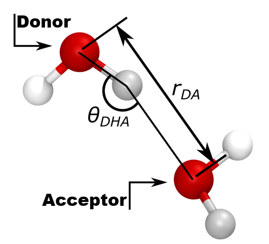

# Hydrogen Bond Calculation Modifier for OVITO

## Overview

This code provides a modifier for OVITO to calculate the number of angles and export the particle identifier to make the angles. It is specifically designed for systems like water where hydrogen bonding plays a significant role.

---
## Installation

To install the package, ensure you are in the directory containing the `pyproject.toml` file and run the following command:

```bash
pip install .
```
## Usage
<div align="center">
	
	<p><strong>Figure 1: Hydrogen bond model</strong></p>
</div>

The modifier can be seamlessly integrated into OVITO's pipeline, similar to other built-in modifiers.

If your system uses different bond lengths or angle criteria, you can modify:
Donor-Acceptor bond length cut-off less than da_rcut.
Donor-H_atom_Acceptor angle should be higher than dha_rangle.

### Steps to Use the Modifier

1. Import the module:
   ```python
   from CalculateParticleTypeAngles import CalculateParticleTypeAngles
   ```
2. Append the modifier to your OVITO pipeline. For example, to calculate the number of hydrogen bonds in each frame, use the following code:
   ```python
   pipeline.modifiers.append(CalculateParticleTypeAngles(donor_type= 5, accep_type=5,  center_type=6, DA_rcut=3.5, DHA_acut=150, HD_rcut=1.05, HA_rcut=3.0))
   ```
3. The modifier computes the global attributes and angle table:

No-angles: The total number of angles.
angle-triplet: Angle triblet (Table).

### Example
	```python
	from ovito.io import import_file, export_file
	from CalculateParticleTypeAngles import CalculateParticleTypeAngles
	
	# Import trajectory file
	pipeline = import_file("trajectory_file.data")
	
	pipeline.modifiers.append(CalculateParticleTypeAngles(donor_type= 5, accep_type=5,  center_type=6, DA_rcut=3.5, DHA_acut=150, HD_rcut=1.05, HA_rcut=3.0))
	
	# Compute the pipeline and export table
	export_file(pipeline, "21.test/test.dat", format="txt/table", key="angle-triplet")
	data = pipeline.compute()
	# Print the total number of angles
	print("total_angles", data.attributes["No-angles"])
	
	```
	
## Limitations
### Particle Types:
The calculation depends on correctly assigned particle types for donors, acceptors, and center atoms (H_atom). Ensure your simulation data has these particle types accurately specified.